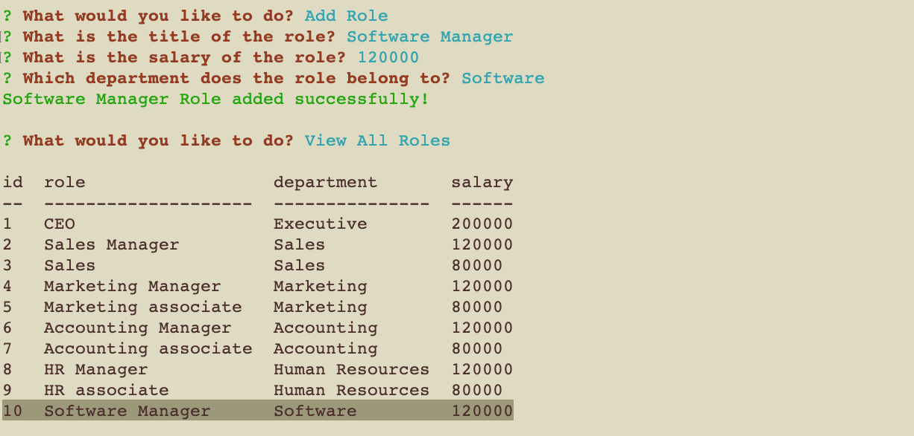
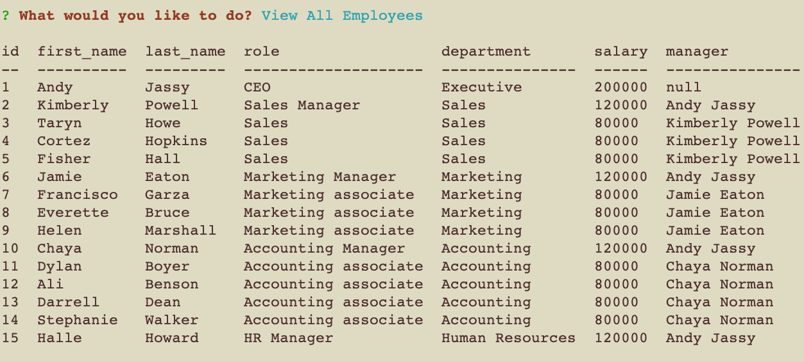
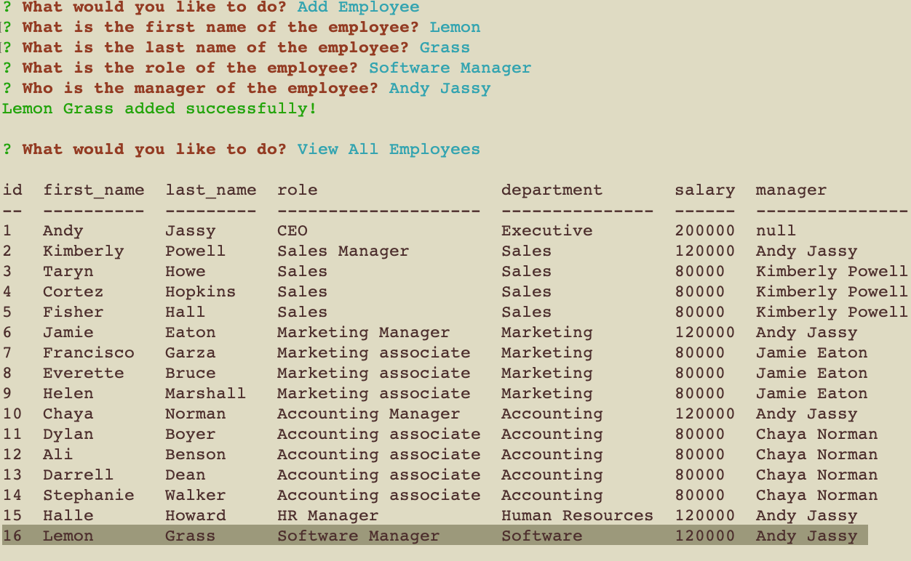
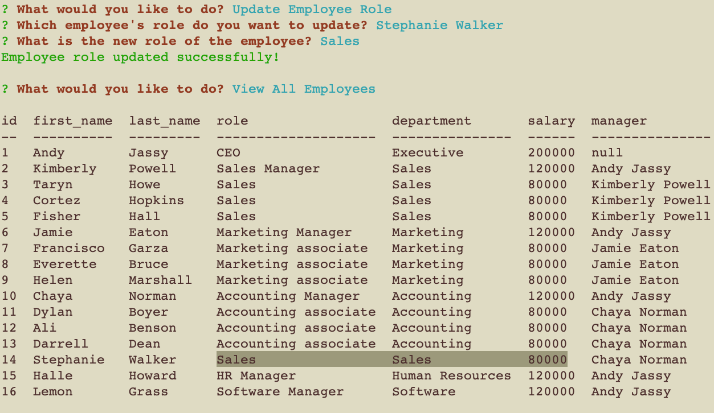
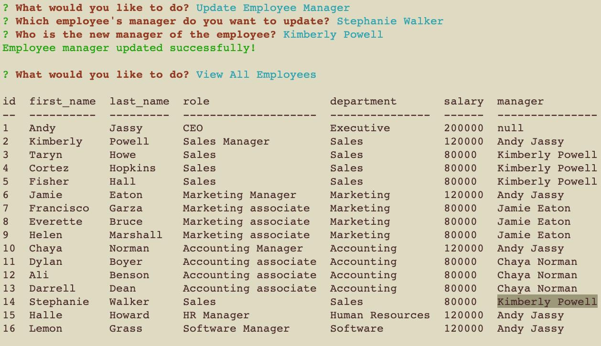
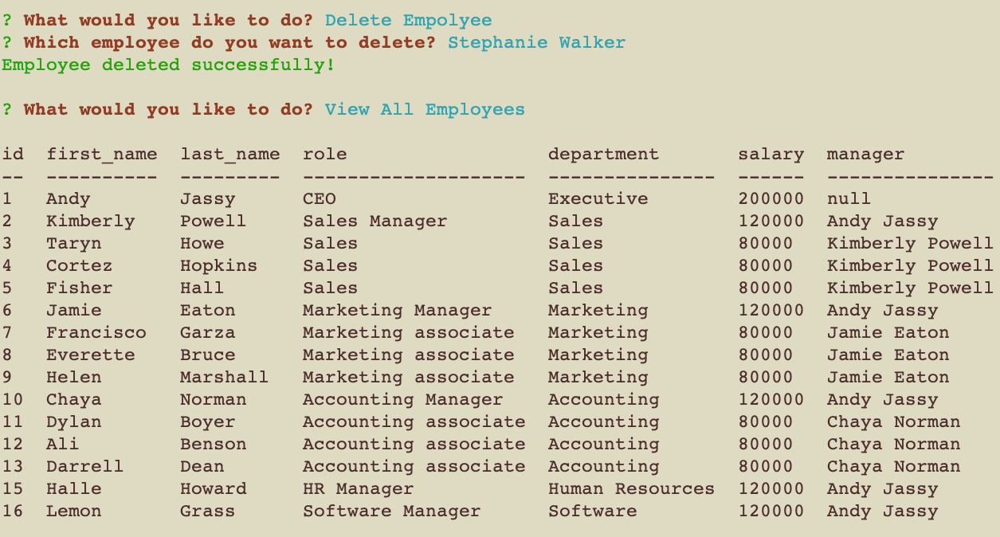
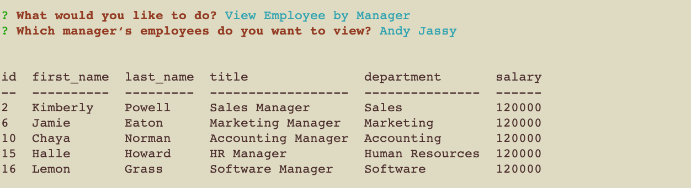
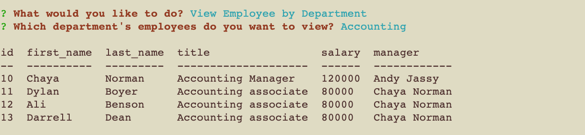
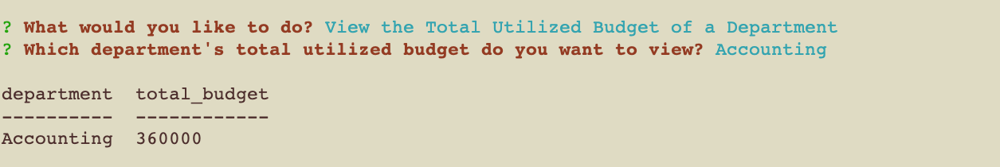

# Employee-Tracker


## Description

This is a command-line application that allows non-developers to easily view and interact with information stored in a company's employee database. This is implemented using Node.js, Inquirer and MySQL.

## Table of Contents
* [Installation](#installation)
* [Usage](#usage)
* [Screenshot](#screenshot)
* [License](#license) 

## Installation
1. download all files from this repo
2. install all dependencies
```
npm install

```
3. create database schema
```
mysql -u root -p
```
```
mysql> source ./db/schema.sql
```
4. run the application
```
node index.js
```

## Usage

- please refer to this video [https://youtu.be/ScNsDF_SYls](https://youtu.be/ScNsDF_SYls) for a demo of how to use this application.
- When the application starts, the following options will be presented:
    - View All Departments
    - Add Department
    - Delete Department
    - View All Roles
    - Add Role
    - Delete Role
    - View All Employees
    - Add Employee
    - Update Employee Role
    - Update Employee Manager
    - Delete Empolyee
    - View Employee by Manager
    - View Employee by Department
    - View the Total Utilized Budget of a Department
    - Quit
- When users choose one of the options, the corresponding data will be retrieved and be displayed in a formatted table.


## Screenshot
- The design of the database schema

- When application starts:

- View All Departments:

- Add Department:

- Delete Department:

- View All Roles:

- Add Role:

- Delete Role:

- View All Employees:

- Add Employee:

- Update Employee Role:

- Update Employee Manager:

- Delete Employee:

- View Employee by Manager:

- View Employee by Department:

- View the Total Utilized Budget of a Department:


## License

MIT